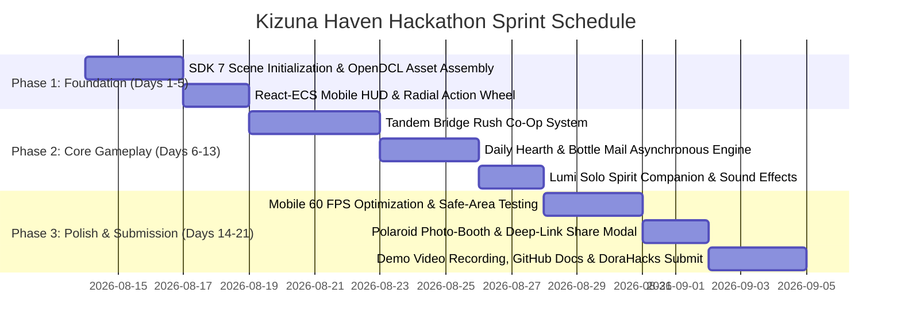

# 🌸 KIZUNA HAVEN (絆のオアシス)
### *The 24/7 Mobile-First Social Playground & Asynchronous Gathering World*
**Decentraland Friendzone Mobile Buildathon Submission Proposal**

---

## 📌 Executive Summary

* **Project Name:** Kizuna Haven *(Japanese: 絆のオアシス — "The Haven of Human Bonds")*
* **Target Platform:** Decentraland Mobile App (iOS & Android) + Desktop Web
* **Framework:** Decentraland SDK 7 (`@dcl/sdk/react-ecs`, `@dcl/sdk/ecs`, TypeScript)
* **Target Audience:** Mobile metaverse explorers, casual multiplayer gamers, friends hanging out on the go, and solo visitors seeking cozy connections.
* **Core Value Proposition:** Solves the classic "empty metaverse room" dilemma by creating a world that is **instantly rewarding for solo players (asynchronous warmth)**, **hilariously fun for 2–4 players (high-energy co-op microgames)**, and **ergonomically tailored for mobile thumb touchscreens**.

```
                       ┌────────────────────────────────────────┐
                       │              KIZUNA HAVEN              │
                       │    The 24/7 Mobile Social Playground   │
                       └────────────────────────────────────────┘
                                            │
        ┌───────────────────────────────────┼───────────────────────────────────┐
        ▼                                   ▼                                   ▼
 🎮 CO-OP MICRO-GAMES              📬 ASYNCHRONOUS WARMTH               📱 MOBILE VIRAL ENGINE
 • Tandem Bridge Rush               • Floating Bottle Mail              • Right-Thumb Radial Wheel
 • Rhythm Synchro-Dance             • Daily Question Hearth             • Polaroid Photo-Booth & Frames
 • Cosmic S'mores Cooking           • Lumi Solo Spirit Guide            • 1-Tap Friend Deep-Link Warp
```

---

## 🎨 Visual Atmosphere & Gameplay Mockups

### 1. The Central Social Hub & Asynchronous Lagoon
> *A twilight sanctuary with real-time mobile touch controls, daily icebreakers, floating bottle messages, and social radial actions.*


### 2. Synchronous 2-Player Co-Op: *"Tandem Bridge Rush"*
> *Fast-paced, 2-player cooperative platforming where one player manipulates holographic bridge glyphs while the other leaps across floating canyons collecting star shards.*


---

## 🕹️ Deep-Dive Feature Breakdown

### Pillar 1: Synchronous Co-Op Micro-Games (Instant 2-to-4 Player Joy)

1. **Tandem Bridge Rush (Asymmetric 2-Player Co-Op):**
   * **The Operator (Player 1):** Stands on the cliffside glyph pedestal. Tapping color-coded rune icons on mobile activates holographic light bridges and bouncy jump pads in real-time.
   * **The Runner (Player 2):** Uses high-response touch `JUMP` and `DASH` controls to navigate the floating canyon, gathering golden Star Shards before the bridge timer expires.
   * **Dynamic Swap:** Reaching the checkpoint switches player roles instantly.
   * **Combo Multiplier:** Coordinated timing increases the shared `SYNC COMBO` multiplier (up to 4x), generating global fireworks.

2. **Emote Synchro-Dance Floor (Mobile Rhythm Groove):**
   * A glowing hexagonal dance floor beneath the Northern Lights.
   * Rings of light contract over mobile rhythm targets. Tapping the correct dance emote in rhythm with your partner builds the "Party Energy Bar".
   * Spectators can tap the cheer feed to toss floating hearts and confetti.

3. **Cosmic S'mores Cookout (Collaborative Mini-Game):**
   * 60-second micro-challenge where players toss ingredients (stardust, giant marshmallows, celestial berries) into the central campfire.
   * Perfect recipes unleash a temporary glowing aura and lofi music broadcast across the whole island.

---

### Pillar 2: Asynchronous Resonance Engine (Never Feels Empty)

1. **The Daily Question Hearth:**
   * A glowing mystical flame at the center of the world that poses a fresh icebreaker question every 24 hours (e.g., *"What late-night song saved your life?"*, *"What's your most chaotic travel story?"*).
   * Players vote on interactive spectrum zones or type short answers that hover as floating lanterns around the campfire.
   * Returning visitors can read responses left by travelers from around the world across different time zones.

2. **Floating Bottle Mail & The Wishing Tree:**
   * Players can write anonymous or signed uplifting notes, jokes, or riddles and cast them into the enchanted lagoon inside glowing glass bottles.
   * Other visitors can fish them out using a simple tap-to-recompose interaction, leave stamp reactions (❤️, 🌟, 🤝), or write replies.
   * The Wishing Tree lets players tie colorful digital ribbons to leave their permanent mark on the island.

3. **"Lumi" — The Autonomous Spirit Companion:**
   * If a player enters the world alone, Lumi (an enchanted glowing fox/wisp spirit) greets them.
   * Lumi guides the player through the world, gives lore hints, and can stand on co-op pressure plates so solo players can test and enjoy all puzzle mechanisms without waiting for someone else.

---

### Pillar 3: Mobile-First UX & Viral Retention Engine

1. **Right-Thumb Radial Action Wheel:**
   * Designed specifically for mobile thumb geometry.
   * A single fluid swipe from the bottom-right corner unlocks quick interactions: **High-Five**, **Bear Hug**, **Sparkler Wand**, **Lofi Boombox**, and **Emote Loops**.

2. **In-Game Polaroid Photo-Booth & Scrapbook:**
   * One-tap snapshot tool that freezes the camera with aesthetic vintage filters and Friendzone sticker stamps.
   * Displays both avatars, their usernames, and the date/time.
   * Generates a one-click shareable image with a custom deep-link URL (`decentraland://world/...`) to invite friends from Discord, WhatsApp, or X directly to your coordinates.

3. **Kizuna Leveling & Persistent Souvenirs:**
   * Hanging out with friends, completing daily prompts, and finishing co-op runs grants "Kizuna XP".
   * Unlocks summonable world props: personal acoustic guitar, sparkler trail, portable glowing lantern, or a miniature campfire kit.

---

## 📱 Mobile UX & Touch Ergonomics Layout

```
 ┌────────────────────────────────────────────────────────────────────────┐
 │ [🌸 Kizuna Tier 4]         [Daily Prompt: Your Late-Night Anthem?]  [📷]│
 │                                                                        │
 │                                                                        │
 │                      🌟 3D GAMEPLAY VIEWPORT 🌟                         │
 │                                                                        │
 │                                                                        │
 │    ┌─────────┐                                      ┌───────────────┐  │
 │    │    ▲    │                                      │ 👏 High-Five  │  │
 │    │ ◄  ●  ► │                                      │ 🤗 Hug / Wave │  │
 │    │    ▼    │                                      │ 💬 Quick Chat │  │
 │    └─────────┘                                      │ 🕺 Emote Wheel│  │
 │  (Left Thumb Zone:                                  └───────────────┘  │
 │   Movement & Voice)                                (Right Thumb Zone:  │
 │                                                     One-Tap Actions)   │
 └────────────────────────────────────────────────────────────────────────┘
```

* **Safe Areas (`ScreenInsetArea`):** All UI elements are inset from screen edges to avoid camera notches and home indicator bars.
* **Large Touch Targets:** All interactive buttons exceed standard $48\times 48\text{ px}$ mobile hitboxes.
* **Zero Desktop Keybinds:** Fully functional without needing keys 1–4 (`IA_ACTION_3`–`6`).

---

## 🏆 Scoring 10/10 on the 7 Hackathon Judging Criteria

| Hackathon Judging Criterion | Kizuna Haven Implementation & Advantage |
| :--- | :--- |
| **1. Mobile-First Experience** | Designed from day one for mobile touchscreens, thumb-arc radial wheels, and intuitive tap gestures rather than desktop keyboard ports. |
| **2. Social Value** | Bridges high-energy 2-player co-op puzzles with deep asynchronous social mechanics (bottle mail, daily hearth, wishing tree). |
| **3. Mobile UX & Accessibility** | Declarative `react-ecs` UI with automatic notch safe-zones, high-contrast visual cues, and zero clutter. |
| **4. Performance & Optimization** | Low-poly stylized geometry ($\le 8\text{k}$ triangles), shared texture atlases, no video lag, 60 FPS performance on mid-range devices. |
| **5. Creativity & Originality** | Blends the cozy ambiance of *Animal Crossing* with the physical collaborative joy of *Sky: Children of the Light* and the warmth of *Kind Words*. |
| **6. Retention & Discovery** | 24-hour rotating icebreakers, Kizuna tiers, unlockable portable toys, and Polaroid snapshots with instant warp invite links. |
| **7. Overall Execution** | Completely autonomous 24/7 world—functions perfectly without requiring a live event host, DJ, or moderator. |

---

## 🛠️ Technical Architecture & Pipeline

### File Structure (Decentraland SDK 7)

```
d:/Friendzone/
├── package.json                       # SDK 7 & react-ecs dependencies
├── scene.json                         # World metadata, parcel coordinates, spawn points
├── models/                            # Optimized .glb assets from OpenDCL
│   ├── campfire_pit.glb
│   ├── log_bench.glb
│   ├── wishing_tree.glb
│   ├── bottle_mail.glb
│   └── puzzle_platform.glb
├── src/
│   ├── index.ts                       # World lifecycle & scene setup
│   ├── config.ts                      # Coordinates, colors, tier XP tables
│   │
│   ├── components/                    # Custom ECS components
│   │   ├── CoOpPlatform.ts            # Bridge states & trigger listeners
│   │   ├── BottleItem.ts              # Message payload & author info
│   │   └── DanceFloorTile.ts          # Rhythm timing & light status
│   │
│   ├── systems/                       # Autonomous game loops
│   │   ├── TandemBridgeSystem.ts      # Real-time co-op bridge mechanics
│   │   ├── RhythmBeatSystem.ts        # Dance timing & particle fx
│   │   ├── DailyHearthSystem.ts       # 24hr prompt rotation & vote tally
│   │   └── LumiCompanionSystem.ts     # Solo NPC bot pathing & puzzle help
│   │
│   ├── ui/                            # React-ECS declarative UI layers
│   │   ├── MobileHUD.tsx              # Top bar, level tier, camera trigger
│   │   ├── RadialSocialWheel.tsx      # Ergonomic thumb menu (high-five, hug)
│   │   ├── CoOpPuzzleHUD.tsx          # Timer, partner portrait, combo meter
│   │   ├── DailyPromptModal.tsx       # Question reading & answer submission
│   │   └── PolaroidShareModal.tsx     # Photo frame with instant invite link
│   │
│   └── network/                       # State Synchronization
│       ├── StateBroadcaster.ts        # Lightweight multi-client sync
│       └── Persistence.ts             # Local/server storage for guestbook
```

---

## 📦 Zero 3D Experience Needed: Asset Sourcing Plan

1. **OpenDCL Catalog (Regenesis Labs):** 8,800+ free, pre-optimized `.glb` models for campfires, trees, wooden docks, floating stones, and lanterns.
2. **Genesis Plaza Asset Library:** High-quality official foliage, lighting fixtures, and terrain pieces.
3. **Decentraland Scene Optimizer:** Auto-compress textures and reduce draw calls.
4. **AI Code Generation:** All SDK 7 TypeScript, `react-ecs` layouts, animations, and game logic written and maintained by Antigravity.

---

## 📅 3-Week Production Roadmap (Aug 14 – Sep 4)



---

## 🎬 Winning DoraHacks Submission Package

1. **90-Second Mobile Screen Recording:** Split-screen video showing two mobile phones playing together via touch controls—highlighting the radial wheel high-five, solving Tandem Bridge Rush, and fishing a bottle out of the lagoon.
2. **Clean Public GitHub Repository:** Well-documented code, architecture diagrams, installation instructions, and open-source MIT license.
3. **Live DCL World Link:** Direct 1-tap link to load the world in the Decentraland Mobile App.
