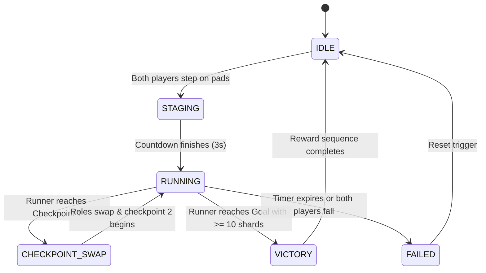

# Data Model: Kizuna Haven Core Experience

**Feature**: `specs/001-kizuna-haven-core`  
**Date**: 2026-08-20  
**Status**: Completed

---

## 1. Entities & Schema Definitions

### 1.1 `KizunaProfile`
Represents a visitor's local and session progression state.

```typescript
export interface KizunaProfile {
  userId: string;                   // Decentraland avatar address or session ID
  displayName: string;              // User display name
  kizunaLevel: number;              // Level 1 to 10
  kizunaXp: number;                 // Current XP towards next level
  unlockedProps: string[];          // List of unlocked portable props (e.g., 'sparkler', 'boombox')
  dailyPromptsAnswered: number;     // Total daily questions answered
  coopRoundsCompleted: number;      // Total Tandem Bridge Rush runs completed
  lastCheckInDate: string;          // ISO date string (YYYY-MM-DD) for streak calculation
  streakDays: number;               // Current consecutive visit streak
}
```

**Validation Rules:**
* `kizunaLevel` must be an integer between 1 and 10.
* `kizunaXp` resets upon level progression based on formula $\text{threshold} = \text{level} \times 100$.

---

### 1.2 `DailyPrompt` & `PromptAnswer`
Represents the active 24-hour icebreaker and visitor submissions.

```typescript
export interface DailyPrompt {
  promptId: string;                 // Deterministic ID based on epoch day (e.g., 'prompt-20260820')
  questionText: string;             // Question prompt text
  category: 'music' | 'story' | 'metaverse' | 'chill' | 'hot-take';
  options?: string[];               // Optional multiple choice options
  voteDistribution?: Record<string, number>; // Vote counts per option
  activeDate: string;               // YYYY-MM-DD
}

export interface PromptAnswer {
  answerId: string;                 // Unique answer ID
  promptId: string;                 // Associated prompt ID
  authorId: string;                 // User ID
  authorName: string;               // Display name
  textAnswer?: string;              // Free-form text response (max 140 chars)
  selectedOptionIndex?: number;     // Selected option index if multiple choice
  timestamp: number;                // Unix epoch timestamp (ms)
}
```

**Validation Rules:**
* `textAnswer` length must not exceed 140 characters.
* One answer submission allowed per `userId` per `promptId`.

---

### 1.3 `BottleMessage`
Represents a user-generated message floating in the lagoon.

```typescript
export interface BottleMessage {
  bottleId: string;                 // UUID
  authorId: string;                 // User ID
  authorName: string;               // Display name
  content: string;                  // Note content (max 180 chars)
  createdAt: number;                // Creation timestamp (ms)
  reactions: {
    heart: number;
    star: number;
    handshake: number;
  };
  ribbonColor: 'pink' | 'gold' | 'cyan' | 'purple';
  position: { x: number; y: number; z: number }; // 3D coordinates in lagoon
}
```

**Validation Rules:**
* `content` length must be between 1 and 180 characters.
* Total active floating bottles rendered in lagoon capped at 20.

---

### 1.4 `CoOpSession` & `BridgeState`
Represents an active *Tandem Bridge Rush* game instance.

```typescript
export type CoOpRole = 'OPERATOR' | 'RUNNER';

export type CoOpPhase = 'IDLE' | 'STAGING' | 'RUNNING' | 'CHECKPOINT_SWAP' | 'VICTORY' | 'FAILED';

export interface BridgeState {
  bridgeIndex: number;              // 0 to 4
  isActive: boolean;                // Whether the bridge is materialized
  color: 'BLUE' | 'ORANGE' | 'PURPLE';
  remainingDurationMs: number;      // Timer before bridge de-materializes
}

export interface CoOpSession {
  sessionId: string;
  operatorId: string;               // Player 1 ID
  runnerId: string;                 // Player 2 ID
  phase: CoOpPhase;
  currentCheckpoint: number;        // 0 (Start), 1 (Midpoint), 2 (Goal)
  starShardsCollected: number;      // Collected items (0 to 15)
  syncMultiplier: number;           // 1x to 4x
  elapsedTimeMs: number;            // Timer tracking
  maxDurationMs: number;            // Time limit (120,000 ms)
  bridges: BridgeState[];
}
```

**State Transitions:**


---

### 1.5 `DanceFloorPerformance`
Represents active rhythm dance floor sessions.

```typescript
export interface DanceFloorPerformance {
  activeDancers: string[];          // User IDs currently on dance floor
  partyEnergy: number;              // 0 to 100%
  currentSyncStreak: number;        // Consecutive synchronized beats
  activeBeatIndex: number;          // Current beat in sequence
  beatIntervalMs: number;           // Timing window between beats (e.g., 800ms)
  targetEmoteId: string;            // Required emote identifier for current beat
}
```

---

### 1.6 `LumiCompanionState`
Represents the state of the autonomous NPC spirit guide.

```typescript
export type LumiMode = 'IDLE_PERCH' | 'FOLLOW_GUIDE' | 'COOP_ASSIST' | 'CELEBRATE';

export interface LumiCompanionState {
  currentMode: LumiMode;
  targetPlayerId: string | null;
  targetPosition: { x: number; y: number; z: number };
  assistPlateIndex: number | null;
  animationState: 'FLY_IDLE' | 'FLOAT_FOLLOW' | 'PRESS_SWITCH' | 'SPARKLE_CHEER';
}
```
